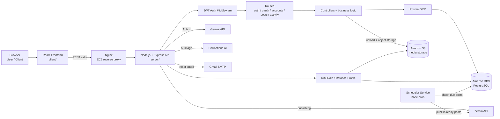
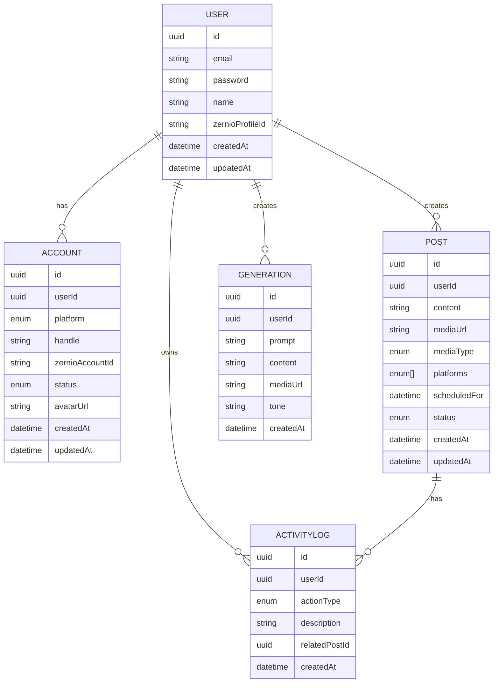

# SocialSync Architecture

## 1. Goal

SocialSync is a social media automation platform that combines:

- user authentication
- AI-driven content generation
- scheduled social publishing
- account management for connected platforms
- activity tracking and audit logging

The architecture is intentionally kept narrow and production-friendly: EC2, RDS, S3, and IAM only.

---

## 2. Core AWS Architecture



---

## 3. System Layers

### 3.1 Presentation Layer

The frontend is a React + Vite application under `client/`.

It includes pages for:

- login and registration
- dashboard overview
- AI composer
- scheduler
- connected account management
- activity viewing

Important frontend structure:

- `client/src/App.tsx`
- `client/src/context/AuthContext.tsx`
- `client/src/pages/*`
- `client/src/components/*`
- `client/src/api/axios.ts`

### 3.2 Application Layer

The backend is a TypeScript Express service in `server/`.

It is responsible for:

- request handling
- JWT verification
- validation and business logic
- account and post orchestration
- scheduler execution
- external API integration

The major bootstrapping file is `server/server.ts`.

### 3.3 Security Layer

The backend security structure includes:

- JWT protection on routes via `protect`
- bcrypt password hashing
- hash-based reset tokens
- rate limiting on auth routes
- generic production-safe error responses
- IAM role-based access to AWS resources

### 3.4 Data Layer

The application uses Prisma with PostgreSQL on RDS.

The schema includes:

- `User`
- `Account`
- `Post`
- `Generation`
- `ActivityLog`

This gives structured persistence for authentication, scheduled work, account state, and activity tracking.

### 3.5 Storage Layer

Files and media content are stored in S3.

Examples:

- uploaded post images
- generated media assets
- object references stored in the database
- signed URLs used for temporary access when required

### 3.6 Scheduler Layer

The background job in `server/services/scheduleService.ts` runs on a cron loop and checks for scheduled posts ready to be published.

This allows the app to process due posts asynchronously without blocking the web request.

---

## 4. Component Breakdown

### Frontend components

- `client/src/pages/Login.tsx`
- `client/src/pages/Dashboard.tsx`
- `client/src/pages/AIComposer.tsx`
- `client/src/pages/Schedular.tsx`
- `client/src/pages/Accounts.tsx`
- `client/src/components/SideBar.tsx`
- `client/src/components/PlatformPickerModal.tsx`

These components create the UX for managing users, creating content, and scheduling publishing.

### Backend routes

- `/api/auth` — login, signup, forgot-password, reset-password
- `/api/oauth` — social account oauth URL generation and sync
- `/api/accounts` — account listing and disconnect behavior
- `/api/posts` — scheduled posts and generation endpoints
- `/api/activity` — activity retrieval

### Controllers

- `authController.ts` — login, registration, password reset logic
- `socialAuthController.ts` — OAuth URL generation and syncing external accounts
- `accountControllers.ts` — connected account management
- `postController.ts` — generation and scheduling logic
- `activityController.ts` — activity read operations

### Supporting configuration

- `server/config/prisma.ts` — Prisma client setup
- `server/config/s3.ts` — S3 client setup
- `server/config/s3Url.ts` — signed URL creation
- `server/config/mailer.ts` — nodemailer configuration
- `server/config/zernio.ts` — Zernio client configuration

---

## 5. Data Model Architecture



This model supports the social automation lifecycle end-to-end: user, connected accounts, generated content, scheduled posts, and publish events.

---

## 6. Runtime Patterns

### 6.1 Login and protected access

- client posts credentials to `/api/auth/login`
- backend verifies password and issues a JWT
- frontend stores token and sends it in future requests
- `protect` middleware checks JWT and user existence

### 6.2 AI content generation

- user enters prompt and preferences in the AI composer
- API calls Gemini for text generation
- optional image generation uses Pollinations
- result is saved as a `Generation` record and shown in the UI

### 6.3 Scheduling and publishing

- user creates a post with content, media, and target platforms
- post is stored in PostgreSQL with status `scheduled`
- cron scheduler watches for due posts
- scheduler resolves connected social account IDs and publishes through Zernio
- status moves to `published` or `failed`

### 6.4 Account synchronization

- OAuth URL is generated using the user profile and target platform
- external worker returns the user’s connected social accounts
- account records are synced to the database, scoped to the current user

---

## 7. External Integrations

These services sit outside the AWS core but are part of the runtime behavior of the product.

| Service | Role |
|---|---|
| Zernio | manages social account connections and post publishing |
| Google Gemini | generates AI content |
| Pollinations AI | generates or prepares media |
| Gmail SMTP | sends reset-link emails |

This keeps the AWS footprint narrow while still supporting the required product features.

---

## 8. Security Architecture

The current system follows these protections:

- least-privilege IAM permissions on EC2
- database access via Prisma connection config
- JWT-based session auth
- password hashing with `bcrypt`
- reset-token hashing before storage
- rate limit for authentication attempts
- production-safe generic responses for unexpected server errors

---

## 9. Deployment Pattern

The application sits on a simple AWS deployment topology:

```text
Browser -> EC2 -> Express API -> PostgreSQL on RDS
                     |
                     +-> S3 for media
                     +-> IAM for AWS auth
                     +-> external services (Gemini, Zernio, Gmail)
```

This is the intended and supported architecture for the project.

---

## 10. Final Architecture Summary

The system is designed as a small, maintainable, AWS-first application:

- EC2 hosts the runtime
- RDS stores relational application data
- S3 stores media and uploads
- IAM limits runtime AWS permissions
- the app integrates with external AI/social services to deliver the product features

This is the architecture the project should continue to target.
