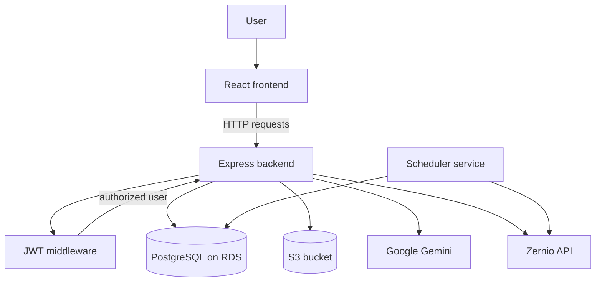

# Request and Data Flow

## 1. High-Level Flow



---

## 2. Authentication Flow

```text
User enters email and password
        |
        v
POST /api/auth/login
        |
        v
Validate request body
        |
        v
Compare password using bcrypt
        |
        v
Generate JWT containing user id
        |
        v
Return token to frontend
        |
        v
Frontend stores token and sends it on protected requests
        |
        v
Auth middleware verifies token and loads user from PostgreSQL
```

The auth middleware is implemented in `server/middlewares/authMiddleware.ts` and is used to protect routes such as post creation and account access.

---

## 3. AI Content Generation Flow

```text
User opens AI composer
        |
        v
Submit prompt + tone + generation settings
        |
        v
POST /api/posts/generate
        |
        v
Backend validates authenticated user
        |
        v
Google Gemini generates text content
        |
        v
Optional image generation flow calls Pollinations AI
        |
        v
Generated content and optional media metadata are saved to PostgreSQL
        |
        v
Response returns generated content to the frontend
```

This is the content generation lifecycle in the app and is handled by the generated-post API flow in the backend controllers.

---

## 4. Scheduling and Publishing Flow

```text
User fills content and schedule time in the scheduler UI
        |
        v
POST /api/posts
        |
        v
Backend validates auth and stores the post as scheduled
        |
        v
Database record includes content, platforms, scheduledFor, and status
        |
        v
node-cron scheduler checks for due posts
        |
        v
When due, scheduler resolves connected accounts for the user/platforms
        |
        v
The app generates a presigned link from S3 if media exists
        |
        v
Zernio publishes the content to the connected social accounts
        |
        v
Post status updates to published or failed and activity log is written
```

The scheduler logic lives in `server/services/scheduleService.ts` and is started when the application boots in `server/server.ts`.

---

## 5. Social Account Sync Flow

```text
User clicks connect account in the UI
        |
        v
GET /api/oauth/:platform/url
        |
        v
Backend creates or reuses a user-specific Zernio profile
        |
        v
Zernio returns an authorization URL
        |
        v
User authorizes the platform
        |
        v
Accounts are fetched and synced back to PostgreSQL
        |
        v
Connected account records are matched by user + zernioAccountId
```

This keeps the social account records scoped to the authenticated user and avoids cross-user leakage.

---

## 6. Media Upload Flow

```text
User uploads media from the client
        |
        v
Multipart request hits POST /api/posts
        |
        v
Backend stores the file and prepares it for S3 upload
        |
        v
S3 object is created and stored in the configured bucket
        |
        v
Database saves the media URL reference for the post
```

This keeps file storage outside the application filesystem and centralizes media handling in S3.

---

## 7. Password Reset Flow

```text
User requests a reset link
        |
        v
POST /api/auth/forgot-password
        |
        v
App checks email and generates a secure token
        |
        v
Hash of token is stored in database
        |
        v
Email with reset link is sent via Gmail SMTP
        |
        v
User submits new password
        |
        v
Backend validates token and updates the password hash
```

The token hash is stored instead of the raw token to reduce risk in case of database exposure.

---

## 8. Data Coverage by Model

- `User`: identity and auth data
- `Account`: connected social account metadata
- `Post`: scheduled content records
- `Generation`: AI-generated drafts and content outputs
- `ActivityLog`: publishing history and app activity

This is the complete operational model for the application.

---

## 9. Final System View

```text
Browser
   -> Frontend UI
   -> EC2-hosted Express API
         -> JWT auth
         -> Prisma + PostgreSQL (RDS)
         -> S3 object storage
         -> external services (Gemini, Zernio, Gmail)
         -> scheduler for queued posts
```

This is the final end-to-end system flow for SocialSync.
